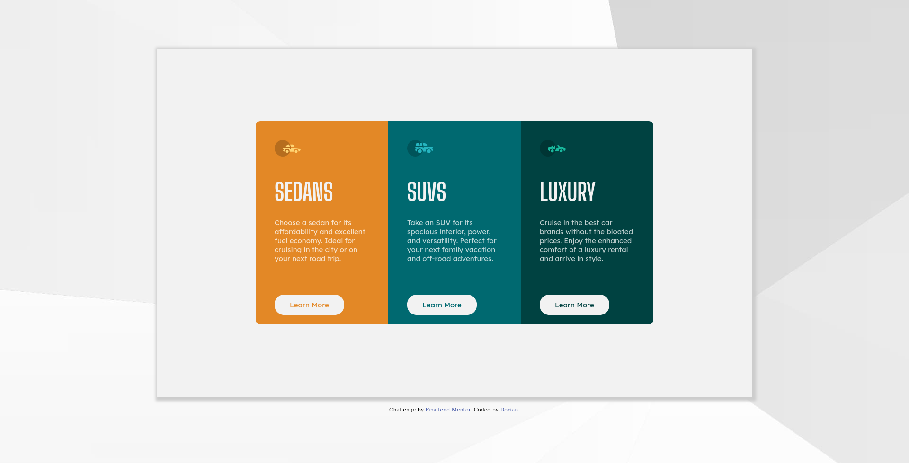
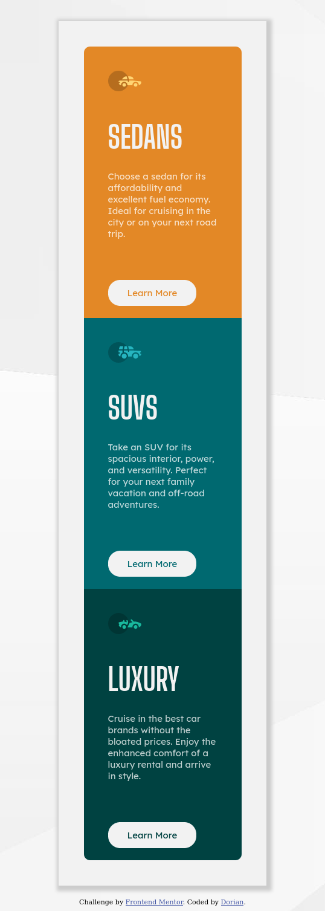

# Frontend Mentor - 3-column preview card component solution

This is a solution to the [3-column preview card component challenge on Frontend Mentor](https://www.frontendmentor.io/challenges/3column-preview-card-component-pH92eAR2-). Frontend Mentor challenges help you improve your coding skills by building realistic projects. 

## Table of contents

- [Overview](#overview)
  - [The challenge](#the-challenge)
  - [Screenshot](#screenshot)
  - [Links](#links)
- [My process](#my-process)
  - [Built with](#built-with)
  - [What I learned](#what-i-learned)
  - [Continued development](#continued-development)
  - [Useful resources](#useful-resources)
- [Author](#author)

## Overview

### The challenge

Users should be able to:

- View the optimal layout depending on their device's screen size
- See hover states for interactive elements

### Screenshot



### Links

- Solution URL: [Add solution URL here](https://your-solution-url.com)
- Live Site URL: [Add live site URL here](https://your-live-site-url.com)

## My process

### Built with

- Semantic HTML5 markup
- CSS custom properties
- Flexbox

### What I learned
Set variable in css
```css
:root {
  --very-light-gray: hsl(0, 0%, 95%);
}
#global {
  background-color: var(--very-light-gray);
}
```
Set a new css when size change
```css
@media only screen and (max-width: 900px) {
}
```

Used box-shadow
```css
box-shadow: 3px 3px 5px 6px #ccc;
```
### Continued development

Areas for improvement:
- Positioning of the buttons
- Positioning in the body of the main white div
- Size of the cards when resizing

### Useful resources

- [Flex Guide](https://css-tricks.com/snippets/css/a-guide-to-flexbox/) - It's a tutorial to  understand well flex positioning.
- [css tricks](https://css-tricks.com/guides/) - It's a guide website for many css concepts.
## Author

- Frontend Mentor - [@Dorian332](https://www.frontendmentor.io/profile/Dorian332)